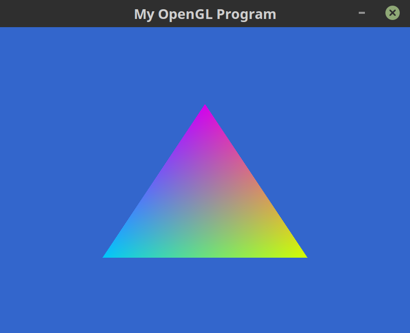
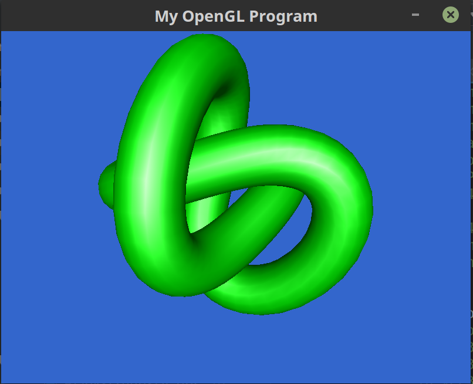

# StarterGL
Computer Graphics Project #0.5 OpenGL Fundamentals

## Demo Snaps

### BlankScreenSDL

* Draws a blank window using SDL.

### TriangleColored - User Input Supported

* Displays a triangle onscreen with colours of fragments interpolated across vertices.
* Down Key rotates the vertex colors clockwise.
* Up Key changes Red component of Top Vertex.
* Left Key changes Green component of Left Vertex.
* Right Key changes Blue component of Right Vertex.

### Cube3D

* Displays a cube onscreen without Z Buffering.

### CubeLit1VBO

* Displays a cube onscreen with Z Buffering.

### ModelLoad - User Input Supported

* Displays a model onscreen with Blinn-Phong lighting.
#### Translations
* Down Key translates the model in the downward direction.
* Up Key translates the model in the upward direction.
* Left Key translates the model in the left direction.
* Right Key translates the model in the right direction.
* ' Key translates the model inward.
* / Key translates the model outward.
#### Rotations
* W Key rotates the model inward.
* S Key rotates the model outward.
* A Key rotates the model in the left direction.
* D Key rotates the model in the right direction.
* Q Key rotates the model in the clockwise direction.
* E Key rotates the model in the counter-clockwise direction.